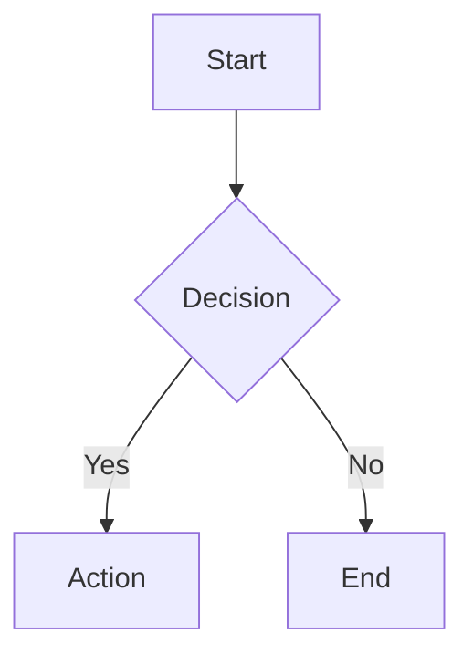
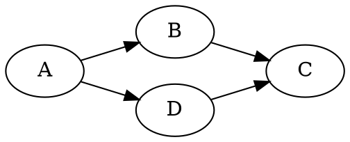

# Markdown Extensions — Design Document

**Feature:** Extend Claspt's markdown editor and preview with rich content rendering — math formulas, diagrams, charts, timelines, kanban boards, spreadsheets, and more. All baked into the app with per-extension toggles.

**Status:** Proposed
**Version:** 1.0
**Date:** 2026-03-02

**Security note:** All rendered HTML is sanitized through DOMPurify before DOM insertion, as in the existing preview pipeline. Extensions add allowed tags/attributes to the DOMPurify config on a per-extension basis.

---

## Table of Contents

1. [Motivation](#1-motivation)
2. [Extension Catalog](#2-extension-catalog)
3. [Architecture](#3-architecture)
4. [Toolbar Design](#4-toolbar-design)
5. [Preview Rendering Pipeline](#5-preview-rendering-pipeline)
6. [Editor Integration (CodeMirror 6)](#6-editor-integration-codemirror-6)
7. [Settings UI](#7-settings-ui)
8. [Extension Details](#8-extension-details)
9. [Bundle Size & Performance](#9-bundle-size--performance)
10. [Markdown Portability](#10-markdown-portability)
11. [Implementation Plan](#11-implementation-plan)

---

## 1. Motivation

Claspt uses standard markdown, which handles text beautifully but can't render visual content like formulas, flowcharts, or data charts. Users who write technical notes, engineering docs, project plans, or academic content need these capabilities.

**Design decision: Baked-in with toggles, not a plugin system.**

Rationale:
- Claspt handles encryption keys in-process — running arbitrary plugin code is a security risk
- Plugin ecosystems are a product in themselves (API design, sandboxing, registry, versioning) — overkill for a notes vault
- KaTeX + Mermaid + a few more covers 95% of use cases
- Toggles keep the UI clean for users who don't need extensions
- Lazy loading means disabled extensions have zero performance cost
- All syntax uses standard/widely-adopted conventions — files stay portable

---

## 2. Extension Catalog

### Enabled by Default

| Extension | Syntax | Library | Size (gzip) | Rationale |
|-----------|--------|---------|-------------|-----------|
| **Math (KaTeX)** | `$E=mc^2$` inline, `$$\int_0^1$$` block | katex | ~90KB | Most-requested; standard in technical notes |
| **Diagrams (Mermaid)** | ` ```mermaid ` fenced blocks | mermaid | ~500KB | Flowcharts, sequences, gantt — universal need |
| **Callouts** | `> [!note]`, `> [!warning]`, etc. | Custom | ~2KB | Lightweight, widely adopted (GitHub, Obsidian) |
| **Wiki-links** | `[[Page Name]]` | Custom | ~2KB | Core notes-app feature; cross-references between pages |
| **Footnotes** | `text[^1]` / `[^1]: def` | marked-footnote | ~3KB | Common in long-form writing |

### Disabled by Default (user-enabled)

| Extension | Syntax | Library | Size (gzip) | Rationale |
|-----------|--------|---------|-------------|-----------|
| **Chemical Formulas** | `$\ce{H2O}$` | katex mhchem | +5KB (on top of KaTeX) | Niche; students and researchers |
| **Graphviz Diagrams** | ` ```dot ` or ` ```graphviz ` blocks | @viz-js/viz (WASM) | ~400KB | Advanced directed graphs; complements Mermaid |
| **Charts** | ` ```chart ` blocks (JSON/YAML config) | Chart.js | ~200KB | Bar, line, pie, scatter — data visualization |
| **Music Notation** | ` ```abc ` blocks | abcjs | ~200KB | Sheet music; very niche |
| **Presentations** | `---` slide separators + `<!-- slide -->` | Custom renderer | ~10KB | Turn a page into a slideshow |
| **Embeds** | `@[youtube](url)`, `@[tweet](url)` | Custom iframe sandbox | ~5KB | Embed external media; security-sensitive |
| **Table of Contents** | `[[toc]]` placeholder | Custom | ~1KB | Auto-generated from headings |
| **Timelines** | ` ```timeline ` blocks (YAML events) | vis-timeline | ~150KB | Project history, changelogs |
| **Kanban Boards** | ` ```kanban ` blocks (list-based syntax) | Custom renderer | ~15KB | Visual task boards from markdown lists |
| **Spreadsheets** | ` ```spreadsheet ` blocks (CSV-like) | Custom with formula engine | ~50KB | Editable grid with basic formulas |

### Total Additional Bundle

| Scenario | Loaded Size |
|----------|-------------|
| Defaults only (Math + Mermaid + Callouts + Wiki-links + Footnotes) | ~600KB |
| All extensions enabled | ~1.7MB |
| No extensions enabled | 0KB |

All lazy-loaded — disabled extensions are never fetched, parsed, or executed.

---

## 3. Architecture

### Current State

```
Content (markdown string)
    |
    v
  Marked (GFM parser)
  + DOMPurify sanitization
    |
    v
  HTML (rendered safely)
```

### With Extensions

```
Content (markdown string)
    |
    v
  Pre-processors (run before Marked)
    - Secret block masking (existing)
    - Wiki-link resolver  [[...]] -> links
    - Embed syntax  @[type](url) -> HTML
    |
    v
  Marked (GFM parser)
  + marked-footnote
  + Custom extensions:
      - KaTeX inline/block renderer
      - Callout blockquote transformer
      - TOC heading collector
      - Fenced block router:
          ```mermaid  -> Mermaid renderer
          ```dot      -> Graphviz renderer
          ```chart    -> Chart.js renderer
          ```abc      -> abcjs renderer
          ```timeline -> Timeline renderer
          ```kanban   -> Kanban renderer
          ```spreadsheet -> Sheet renderer
    |
    v
  DOMPurify (sanitize all output)
    + allow SVG tags (for diagrams/charts)
    + allow iframe[src] for allowlisted origins only (embeds)
    |
    v
  Post-processors (run after sanitized render)
    - Mermaid: init SVG rendering
    - Chart.js: init canvas rendering
    - Timeline: init vis-timeline
    - Spreadsheet: mount grid component
    - Media resolver (existing)
```

### Mobile: Shared Preview via WebView

The mobile app currently uses `react-native-marked`, which renders markdown as native React Native components (Text, View, Image in a FlatList). This approach cannot render extensions — there's no DOM, no SVG, no Canvas.

**Solution:** Replace the native markdown renderer with a **WebView-based preview** that runs the same Marked + DOMPurify + extensions pipeline as desktop.

```
Current mobile pipeline:
  markdown string → react-native-marked → Native FlatList components

New mobile pipeline:
  markdown string → WebView(Marked + DOMPurify + extensions) → HTML preview
```

**Why this works:**

| Aspect | Native components (current) | WebView (new) |
|--------|---------------------------|---------------|
| Extensions | Not possible | All 15 work immediately |
| Code sharing | None with desktop | Same preview pipeline |
| Performance | Slightly faster scroll | Slightly slower (but fine for notes) |
| Secret blocks | Interleaved components | Masked in HTML (desktop pattern) |
| Theme | React props | CSS variables (same as desktop) |

**Precedent:** Obsidian mobile uses WebView-based preview with the same rendering engine as desktop. Well-proven pattern.

**Migration scope:**
- Create a shared preview HTML bundle (`shared/preview/`) used by both desktop and mobile
- Replace `react-native-marked` usage in `PageViewScreen.tsx` and `PageEditScreen.tsx` with a `WebView` component loading the shared bundle
- Align mobile secret block handling with desktop's masking approach
- Pass theme colors as CSS variables into the WebView
- Bridge `postMessage` for navigation events (wiki-link clicks, media resolution)

**Result:** Extensions work on all platforms — desktop, iOS, Android — from launch. Zero per-extension mobile work.

### Extension Registry Pattern

Each extension implements a common interface:

```typescript
interface MarkdownExtension {
  id: string;
  name: string;
  description: string;
  defaultEnabled: boolean;
  icon: React.ComponentType;          // for toolbar
  toolbarInsert?: string;             // text to insert when toolbar button clicked
  toolbarSection: 'insert' | 'block'; // which toolbar row/group
  markedExtension?: MarkedExtension;  // hook into Marked parser
  preprocess?: (content: string) => string;
  postprocess?: (container: HTMLElement) => void | (() => void);  // cleanup return
  load: () => Promise<void>;          // lazy-load library
}
```

Extensions are registered in a central `src/lib/extensions/registry.ts`. The preview component and toolbar both read from this registry, filtered by user settings.

---

## 4. Toolbar Design

### Current Toolbar (single row)

```
[H1][H2][H3] | [B][I][S][`] | [*][1.][x][>] | [link][img][</>][-][table] | [lock][share] | [?]
```

### Problem

Adding 13+ extension buttons to one row overflows. Need a strategy for scaling.

### Solution: Two-Row Adaptive Toolbar

**Row 1 — Core (always visible, unchanged)**
The existing toolbar buttons. Markdown fundamentals.

**Row 2 — Extensions (visible when any extension is enabled)**
Only shows buttons for enabled extensions. Hidden entirely when no extensions are active.

```
[math][diagram][graphviz][chart] | [music][timeline][kanban][sheet] | [footnote][wikilink][toc] | [slides]
```

### Adaptive Behavior

1. **No extensions enabled** — Row 2 hidden, toolbar is single-row (identical to today)
2. **1-6 extensions enabled** — Row 2 shows, compact — only enabled buttons appear
3. **7+ extensions enabled** — Row 2 shows, natural wrapping within flex container
4. **Narrow window** — Row 2 wraps gracefully (flex-wrap)

### Implementation

```tsx
// EditorToolbar.tsx
export function EditorToolbar() {
  const enabledExtensions = useExtensionStore((s) => s.enabledExtensions);
  const extensionButtons = enabledExtensions
    .filter((ext) => ext.toolbarInsert)  // only extensions with toolbar actions
    .sort((a, b) => a.toolbarOrder - b.toolbarOrder);

  return (
    <div className="flex flex-col border-b border-border">
      {/* Row 1: Core formatting (unchanged) */}
      <div className="flex items-center gap-0.5 px-4 py-1.5">
        {/* ... existing buttons exactly as they are ... */}
      </div>

      {/* Row 2: Extension buttons (only when extensions are enabled) */}
      {extensionButtons.length > 0 && (
        <div className="flex flex-wrap items-center gap-0.5 border-t border-border/50 px-4 py-1">
          {extensionButtons.map((ext) => (
            <ToolbarButton
              key={ext.id}
              title={ext.name}
              onClick={() => insertAtCursor(ext.toolbarInsert!)}
            >
              <ext.icon />
            </ToolbarButton>
          ))}
        </div>
      )}
    </div>
  );
}
```

### Toolbar Button Grouping

Extensions are grouped by category in Row 2 with dividers:

| Group | Extensions |
|-------|-----------|
| **Science** | Math, Chemical formulas |
| **Diagrams** | Mermaid, Graphviz, Charts |
| **Media** | Music, Embeds |
| **Planning** | Timelines, Kanban, Spreadsheets |
| **Navigation** | Footnotes, Wiki-links, TOC, Slides |

### What Each Button Inserts

| Extension | Toolbar Click Inserts |
|-----------|----------------------|
| Math (KaTeX) | `$$\n\n$$` (block math, cursor in middle) |
| Mermaid | ` ```mermaid\ngraph TD\n  A --> B\n``` ` |
| Graphviz | ` ```dot\ndigraph {\n  A -> B\n}\n``` ` |
| Charts | ` ```chart\ntype: bar\nlabels: [A, B, C]\ndata: [10, 20, 30]\n``` ` |
| Chemical | `$\ce{}$` (cursor inside) |
| Music | ` ```abc\nX:1\nT:Title\nM:4/4\nK:C\nCDEF\n``` ` |
| Timelines | ` ```timeline\n- date: 2026-01\n  title: Event\n  description: Details\n``` ` |
| Kanban | ` ```kanban\n## To Do\n- Task 1\n- Task 2\n\n## In Progress\n- Task 3\n\n## Done\n- Task 4\n``` ` |
| Spreadsheet | ` ```spreadsheet\nName, Amount, Tax\nAlice, 100, =B1*0.1\nBob, 200, =B2*0.1\n``` ` |
| Footnotes | `[^1]` at cursor + `\n\n[^1]: ` at end of doc |
| Wiki-link | `[[]]` (cursor inside) |
| TOC | `[[toc]]` |
| Slides | `\n---\n\n` (slide separator) |
| Embeds | `@[youtube](url)` |
| Callouts | `> [!note]\n> ` |

---

## 5. Preview Rendering Pipeline

### 5.1 Marked Extension Registration

The current `MarkdownPreview.tsx` creates a single `Marked` instance. With extensions, this becomes dynamic:

```typescript
// src/lib/extensions/preview-pipeline.ts

export function createMarkedInstance(enabledExtensions: string[]): Marked {
  const md = new Marked({ gfm: true, breaks: true });

  // Always: secret block masking (existing)

  if (enabledExtensions.includes('math')) {
    // Register inline: $...$ and block: $$...$$
    md.use(markedKatex());
  }

  if (enabledExtensions.includes('footnotes')) {
    md.use(markedFootnote());
  }

  if (enabledExtensions.includes('callouts')) {
    md.use(markedCallouts());
  }

  // Fenced blocks: mermaid, dot, chart, abc, timeline, kanban, spreadsheet
  // All use the same pattern: intercept ```lang blocks, render to HTML
  md.use(markedFencedBlocks(enabledExtensions));

  return md;
}
```

### 5.2 Fenced Block Router

All fenced block extensions use the same Marked hook — a custom renderer for code blocks:

```typescript
function markedFencedBlocks(enabled: string[]): MarkedExtension {
  return {
    renderer: {
      code(token) {
        const lang = token.lang?.toLowerCase();

        if (lang === 'mermaid' && enabled.includes('mermaid')) {
          // Source is encoded in data attribute, rendered by post-processor
          return `<div class="ext-mermaid" data-source="${encodeAttr(token.text)}"></div>`;
        }
        if (lang === 'dot' && enabled.includes('graphviz')) {
          return `<div class="ext-graphviz" data-source="${encodeAttr(token.text)}"></div>`;
        }
        if (lang === 'chart' && enabled.includes('charts')) {
          return `<div class="ext-chart" data-source="${encodeAttr(token.text)}"></div>`;
        }
        // ... etc for abc, timeline, kanban, spreadsheet

        // Default: syntax-highlighted code block (existing behavior)
        return false;
      }
    }
  };
}
```

Note: `encodeAttr()` HTML-entity-encodes the source to prevent injection via data attributes. The source is decoded by the post-processor, never inserted as raw HTML.

### 5.3 Post-Render Initialization

After DOMPurify-sanitized HTML is set, a `useEffect` finds placeholder `div`s and initializes the corresponding libraries:

```typescript
// Mermaid: find all .ext-mermaid, call mermaid.render()
// Chart.js: find all .ext-chart, create Canvas + Chart instance
// Timeline: find all .ext-timeline, create vis-timeline
// Spreadsheet: find all .ext-spreadsheet, mount grid component
```

Each post-processor returns a cleanup function to destroy instances on re-render (prevents memory leaks).

### 5.4 DOMPurify Adjustments

Extensions produce SVG (diagrams, charts) and potentially iframes (embeds). DOMPurify config needs per-extension allowlists:

```typescript
const purifyConfig: DOMPurify.Config = {
  ADD_ATTR: ['loading'],
  ADD_TAGS: [] as string[],
};

if (enabled.includes('mermaid') || enabled.includes('graphviz') || enabled.includes('charts')) {
  purifyConfig.ADD_TAGS.push('svg', 'path', 'circle', 'rect', 'line', 'text', 'g', 'defs', 'marker');
}

if (enabled.includes('embeds')) {
  purifyConfig.ADD_TAGS.push('iframe');
  purifyConfig.ADD_ATTR.push('sandbox', 'allow');
  // ALLOWED_URI_REGEXP restricts iframe src to allowlisted origins only
}
```

All HTML continues to be sanitized through DOMPurify — extensions add allowed tags, they don't bypass sanitization.

---

## 6. Editor Integration (CodeMirror 6)

Beyond preview rendering, some extensions benefit from editor-side support:

### 6.1 Inline Math Preview

In the CodeMirror editor, `$...$` inline math can show a rendered preview as a widget decoration:

```
Input:  The energy is $E=mc^2$ which means...
Editor: The energy is [E=mc2] which means...
                       ^^^^^^^ rendered inline widget
```

Uses `ViewPlugin` + `Decoration.widget()` to replace the raw syntax with a KaTeX-rendered span in the editor. Clicking the widget switches back to source for editing.

### 6.2 Fenced Block Preview

For ` ```mermaid ` and similar blocks, show a rendered preview below the code in the editor (not just in the preview pane):

```

+-------------------+
|  [A] --> [B]      |  <-- live preview widget
+-------------------+
```

Uses CodeMirror's `WidgetType` class to insert a DOM element after the fenced block.

### 6.3 Wiki-link Autocomplete

Typing `[[` triggers an autocomplete dropdown showing page titles from the vault:

```
[[Ser|
   +--------------------+
   | Server Setup        |
   | Server Credentials  |
   | Service Accounts    |
   +--------------------+
```

Uses `@codemirror/autocomplete` (already in the dependency tree via lang-markdown).

### 6.4 Callout Styling

In the editor, `> [!warning]` blocks get a tinted left border and icon, making them visually distinct from regular blockquotes even in source mode.

### 6.5 Extension Priority

Not all extensions need editor-side support immediately. Priority:

| Extension | Editor Support | Priority |
|-----------|---------------|----------|
| Math (KaTeX) | Inline preview widget | P1 — high impact |
| Wiki-links | Autocomplete dropdown | P1 — core notes feature |
| Callouts | Colored left border + icon | P1 — low effort, high polish |
| Mermaid | Below-block preview | P2 — nice to have |
| Footnotes | Jump-to-definition | P2 |
| All others | Preview-only (no editor support) | P3 |

---

## 7. Settings UI

New section in SettingsPanel, after existing sections:

```
--- Markdown Extensions ---

  Enabled extensions appear in the editor toolbar and render
  in preview. Disabled extensions have zero performance cost.

  -- Core --
  [x] Math (KaTeX)           Inline $...$ and block $$...$$ formulas
  [x] Diagrams (Mermaid)     Flowcharts, sequences, gantt, ER diagrams
  [x] Callouts               > [!note], > [!warning], > [!tip] blocks
  [x] Wiki-links             [[Page Name]] cross-references
  [x] Footnotes              [^1] reference-style footnotes

  -- Science --
  [ ] Chemical Formulas      $\ce{H2O}$ notation (KaTeX mhchem)

  -- Diagrams & Visuals --
  [ ] Graphviz               ```dot directed graphs (DOT language)
  [ ] Charts                 ```chart bar/line/pie/scatter (Chart.js)
  [ ] Timelines              ```timeline event sequences

  -- Media --
  [ ] Music Notation         ```abc sheet music (ABC notation)
  [ ] Embeds                 @[youtube](url) embedded media

  -- Planning --
  [ ] Kanban Boards          ```kanban visual task boards
  [ ] Spreadsheets           ```spreadsheet editable grids with formulas

  -- Document --
  [ ] Table of Contents      [[toc]] auto-generated heading list
  [ ] Presentations          --- slide separators, fullscreen slideshow
```

### Settings Persistence

Stored in Zustand settings store, persisted to vault config:

```json
{
  "markdown_extensions": {
    "math": true,
    "mermaid": true,
    "callouts": true,
    "wikilinks": true,
    "footnotes": true,
    "chemical": false,
    "graphviz": false,
    "charts": false,
    "timelines": false,
    "music": false,
    "embeds": false,
    "kanban": false,
    "spreadsheets": false,
    "toc": false,
    "presentations": false
  }
}
```

---

## 8. Extension Details

### 8.1 Math — KaTeX

**Syntax:**
- Inline: `$E = mc^2$` renders inline formula
- Block: `$$\int_0^1 f(x)\,dx$$` renders centered display math
- Chemical (when enabled): `$\ce{2H2 + O2 -> 2H2O}$`

**Library:** [KaTeX](https://katex.org/) — fast, renders to HTML (not images), no external dependencies.

**Marked integration:** `marked-katex-extension` or custom inline/block tokenizer.

**Editor support:** Inline widget decoration — renders formula in-place, click to edit source.

**CSS:** KaTeX stylesheet (~25KB) loaded when extension is active.

### 8.2 Diagrams — Mermaid

**Syntax:**
````

````

**Supported diagram types:** Flowchart, Sequence, Gantt, Class, State, ER, Pie, Git graph, Mindmap, Timeline (Mermaid's own), Quadrant chart, Sankey, XY chart.

**Library:** [Mermaid](https://mermaid.js.org/) — renders to SVG.

**Rendering:** Deferred. Placeholder `<div>` with encoded source in data attribute. After DOMPurify sanitization and DOM insertion, `mermaid.render()` converts to SVG. Each render gets a unique ID to prevent conflicts.

**Theme:** Mermaid supports dark theme — pass `theme: 'dark'` to match Claspt's dark UI.

**Error handling:** Invalid syntax shows error message inline (red border + message), not a blank space.

### 8.3 Callouts

**Syntax:**
```markdown
> [!note] Optional Title
> Callout body text here.

> [!warning]
> This is important.
```

**Types and colors:**

| Type | Color | Icon |
|------|-------|------|
| `[!note]` | Blue | Info circle |
| `[!tip]` | Green | Lightbulb |
| `[!warning]` | Amber | Warning triangle |
| `[!danger]` | Red | Alert octagon |
| `[!info]` | Blue | Info circle |
| `[!success]` | Green | Checkmark |
| `[!question]` | Purple | Question mark |
| `[!quote]` | Gray | Quote mark |
| `[!example]` | Purple | List |
| `[!bug]` | Red | Bug |

**Implementation:** Custom Marked extension that transforms `> [!type]` blockquotes into styled `<div class="callout callout-warning">` elements. Output is sanitized by DOMPurify.

**Portable:** Same syntax as GitHub Alerts and Obsidian callouts. Renders as regular blockquotes in editors that don't support callouts.

### 8.4 Wiki-links

**Syntax:**
- `[[Page Name]]` — link to page titled "Page Name"
- `[[Page Name|Display Text]]` — link with custom display text
- `[[Page Name#Heading]]` — link to specific heading

**Behavior on click:** Navigate to the linked page. If page doesn't exist, offer to create it.

**Editor support:** Autocomplete dropdown showing vault page titles when typing `[[`.

**Implementation:** Pre-processor that runs before Marked. Resolves `[[...]]` to anchor elements with data attributes. Post-processor attaches click handlers for navigation.

**Backlinks:** When wiki-links are enabled, the Inspector panel can show a "Backlinks" section — pages that link to the current page.

### 8.5 Footnotes

**Syntax:**
```markdown
Here is a statement that needs a citation[^1].

And another[^note].

[^1]: First reference with explanation.
[^note]: Named footnotes work too.
```

**Library:** `marked-footnote` — Marked extension that handles `[^ref]` inline and `[^ref]:` definitions.

**Rendering:** Superscript numbers in text, footnote list at bottom of page. Clicking a footnote number scrolls to the definition and back.

### 8.6 Graphviz

**Syntax:**
````

````

**Library:** [@viz-js/viz](https://viz-js.com/) — Graphviz compiled to WASM, runs fully client-side. No server needed.

**Rendering:** Source decoded from data attribute, passed to WASM, SVG output sanitized by DOMPurify then inserted into DOM.

**Theme:** Override default colors to match Claspt's dark theme (light edges, dark background).

### 8.7 Charts

**Syntax:**
````
```chart
type: bar
title: Monthly Revenue
labels: [Jan, Feb, Mar, Apr, May]
datasets:
  - label: Revenue
    data: [12000, 19000, 15000, 22000, 18000]
    color: "#d4930a"
  - label: Expenses
    data: [8000, 11000, 9000, 13000, 10000]
    color: "#8b949e"
```
````

**Supported chart types:** bar, line, pie, doughnut, scatter, radar, polarArea, bubble.

**Library:** [Chart.js](https://www.chartjs.org/) — renders to `<canvas>`.

**Config format:** YAML (parsed with `js-yaml`, already common in frontmatter context). Designed to be human-writable — not a JSON dump.

**Theme:** Dark background, light grid lines, accent colors from Claspt palette.

### 8.8 Music Notation

**Syntax:**
````
```abc
X:1
T:Ode to Joy
M:4/4
L:1/4
K:C
E E F G | G F E D | C C D E | E3/2 D/ D2 |
```
````

**Library:** [abcjs](https://www.abcjs.net/) — renders ABC notation to SVG sheet music.

**Rendering:** Parse ABC string, render to SVG, sanitize, insert into DOM. MIDI playback disabled by default to avoid audio surprises.

### 8.9 Presentations / Slides

**Syntax:**
```markdown
# My Presentation

First slide content.

---

## Second Slide

- Bullet point
- Another point

---

## Third Slide

Final content.
```

**Behavior:**
- In normal preview: renders as a regular page with horizontal rules
- A "Present" button appears in the toolbar when the extension is enabled
- Clicking "Present" opens fullscreen mode: `---` separators become slide boundaries
- Arrow keys / swipe to navigate
- Escape to exit

**Implementation:** Custom overlay component that splits content at `---` boundaries and renders one section at a time in fullscreen.

**No external library** — this is a custom renderer (~200 lines). Each slide is a `<div>` rendered via the normal Marked pipeline with DOMPurify sanitization.

### 8.10 Embeds

**Syntax:**
```markdown
@[youtube](https://www.youtube.com/watch?v=dQw4w9WgXcQ)
@[vimeo](https://vimeo.com/123456)
@[tweet](https://twitter.com/user/status/123)
```

**Security:**
- iframes are sandboxed (`sandbox="allow-scripts allow-same-origin"`)
- Only allowlisted origins: `youtube.com`, `youtube-nocookie.com`, `vimeo.com`, `twitter.com`, `codepen.io`
- No arbitrary URL embedding — DOMPurify strips non-allowlisted iframe sources
- Embeds extension must be explicitly enabled by user

**Rendering:** Pre-processor converts `@[type](url)` to iframe HTML with appropriate embed URL transformation (e.g., youtube watch URL converted to embed URL). Output sanitized by DOMPurify with iframe allowlist.

### 8.11 Table of Contents

**Syntax:**
```markdown
[[toc]]

## Chapter 1
### Section 1.1
## Chapter 2
```

**Rendering:** Collects all headings during Marked parse, generates a nested list at the `[[toc]]` placeholder location. Each entry is an anchor link.

**Implementation:** Custom Marked extension that:
1. Registers a tokenizer for `[[toc]]`
2. Hooks into heading rendering to add `id` attributes
3. On render, replaces `[[toc]]` with generated `<nav class="toc">` list

### 8.12 Timelines

**Syntax:**
````
```timeline
- date: 2025-01
  title: Project Started
  description: Initial prototype built
  type: milestone

- date: 2025-06
  title: Beta Release
  description: First public beta with 500 users

- date: 2026-01
  title: v1.0 Launch
  description: Stable release across all platforms
  type: milestone
```
````

**Library:** [vis-timeline](https://visjs.github.io/vis-timeline/) — interactive timeline visualization.

**Config format:** YAML array of events with `date`, `title`, `description`, optional `type`.

**Theme:** Dark background, accent-colored events, muted grid.

**Interaction:** Zoomable, pannable. Hover for details.

### 8.13 Kanban Boards

**Syntax:**
````
```kanban
## To Do
- [ ] Design the API
- [ ] Write documentation
- [ ] Set up CI/CD

## In Progress
- [ ] Build frontend components
- [ ] Implement auth flow

## Done
- [x] Database schema
- [x] Project setup
```
````

**Rendering:** Parses `##` headings as columns, `- [ ]` / `- [x]` items as cards. Renders as a horizontal board with drag-and-drop reordering.

**Interaction in preview:**
- Drag cards between columns
- Check/uncheck items
- Changes write back to the markdown source (modify the fenced block content)

**Implementation:** Custom React component mounted into the preview DOM. Minimal — no external library needed. Flex columns with draggable items (~200 lines).

**Write-back:** When the user drags a card, the component updates the source markdown in the kanban block. This triggers a save, which triggers a git commit — standard Claspt flow.

### 8.14 Spreadsheets

**Syntax:**
````
```spreadsheet
Name, Quantity, Price, Total
Alice, 10, 5.00, =B1*C1
Bob, 20, 3.50, =B2*C2
Carol, 15, 4.25, =B3*C3
, , Total:, =SUM(D1:D3)
```
````

**Rendering:** Editable grid with:
- Column headers from first row
- Cell editing (click to edit)
- Basic formula engine: `=SUM()`, `=AVG()`, `=MIN()`, `=MAX()`, `=COUNT()`, cell references (`A1`, `B2`), arithmetic (`=B1*C1`)
- Auto-recalculation on edit

**Implementation:** Custom component (~400 lines). Lightweight formula parser evaluates cell references and functions. No external library needed — the formula subset is small enough to implement directly.

**Write-back:** Edits update the source CSV in the spreadsheet block, same as kanban.

**Export:** A "Copy as CSV" button on the spreadsheet for pasting into Excel/Sheets.

---

## 9. Bundle Size & Performance

### 9.1 Lazy Loading Strategy

Every extension library is dynamically imported only when enabled:

```typescript
// Only loaded if user has enabled mermaid
if (settings.mermaid) {
  const mermaid = await import('mermaid');
  mermaid.initialize({ theme: 'dark', startOnLoad: false });
}
```

**Impact on app startup:** Zero. Extensions load on first preview render of a page that uses them.

### 9.2 Size Budget

| Component | Size (gzip) | When Loaded |
|-----------|-------------|-------------|
| KaTeX JS + CSS | ~90KB + ~25KB | First `$...$` rendered |
| Mermaid | ~500KB | First ` ```mermaid ` rendered |
| Viz.js (Graphviz WASM) | ~400KB | First ` ```dot ` rendered |
| Chart.js | ~200KB | First ` ```chart ` rendered |
| abcjs | ~200KB | First ` ```abc ` rendered |
| vis-timeline | ~150KB | First ` ```timeline ` rendered |
| Custom renderers (callouts, kanban, spreadsheet, etc.) | ~50KB total | Bundled with app (tiny) |

**Comparison:** The Tauri app binary is ~25MB. Mermaid (~500KB) is 2% of that. These sizes are negligible for a desktop app.

### 9.3 Render Performance

- **KaTeX:** Microseconds per formula. No concern.
- **Mermaid:** 50-200ms for complex diagrams. Render once, cache SVG.
- **Graphviz WASM:** First render ~500ms (WASM init), subsequent <100ms.
- **Chart.js:** <50ms per chart. Canvas rendering is fast.
- **Spreadsheet formula engine:** <1ms for typical sheets (< 100 cells).

**Debouncing:** Preview re-renders are already debounced (300ms after last keystroke). Extensions benefit from this automatically.

**Caching:** For expensive renders (Mermaid, Graphviz), cache the SVG output keyed by source hash. Only re-render when source changes.

---

## 10. Markdown Portability

A core Claspt value is that `.md` files are portable. Every extension syntax degrades gracefully:

| Extension | In Claspt | In GitHub/VS Code | In plain text editor |
|-----------|-----------|-------------------|---------------------|
| `$E=mc^2$` | Rendered formula | Raw text (or rendered with ext) | Raw text |
| ` ```mermaid ` | Rendered diagram | Rendered diagram (GitHub native) | Code block |
| `> [!warning]` | Styled callout | Styled callout (GitHub Alerts) | Blockquote |
| `[[Page Name]]` | Clickable link | Raw text | Raw text |
| `[^1]` | Footnote | Rendered footnote | Raw text |
| ` ```dot ` | Graphviz diagram | Code block | Code block |
| ` ```chart ` | Rendered chart | Code block | Code block |
| ` ```kanban ` | Interactive board | Code block | Code block |
| ` ```spreadsheet ` | Editable grid | Code block | Code block |

**Key property:** No extension uses proprietary binary format. Everything is text in the `.md` file. Worst case: it renders as a fenced code block in other editors, which is perfectly readable.

---
